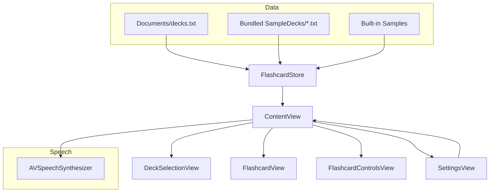

# obo

Flashcard app for kids with bundled sample decks, speech playback, and simple settings.

## Overview
- Browse categories and topics, then review cards one at a time.
- Tap to begin a deck; the first question is spoken automatically if speech is enabled.
- Tap a card to flip between question and answer.
- Replay question/answer audio from the card corner.
- Configure speech, voice, and profile name in Settings.

## Features
- **Bundled sample decks** included in the app bundle.
- **Speech playback** with selectable voice.
- **Settings** for category, speech toggle, voice, and user name.
- **User title** personalization ("Flashcards for <Name>").

## Data Sources & Loading Order
1. `Documents/decks.txt` (if present)
2. Bundled sample decks (`obo/SampleDecks/*.txt`)
3. Built‑in fallback samples

The current source is shown in Settings.

## Sample Deck File Format
Each deck file is plain text with a title and 20 Q/A lines:

```
Title: <Deck Title>

Q: <Question> | A: <Answer>
```

## Speech Behavior
- **Auto‑speak**: when a new deck starts, the first question is spoken once you tap “Tap to begin”.
- **Replay**: use the speaker icon on the card corner to replay question or answer.
- **One‑shot**: replay works even if speech is disabled, but appears muted.

## Project Structure
- `obo/ContentView.swift` — main screen and speech logic
- `obo/DeckSelectionView.swift` — header + topic picker
- `obo/FlashcardView.swift` — card UI + replay buttons + “Tap to begin”
- `obo/FlashcardControlsView.swift` — previous/next controls
- `obo/FlashcardStore.swift` — loading + parsing decks
- `obo/SettingsView.swift` — settings UI
- `obo/SampleDecks/` — bundled sample decks

## Architecture (High Level)


## Build & Run
Open the Xcode project and build the `obo` target.

## Notes
- If you add a new deck file, keep 20 Q/A lines for consistency.
- Category grouping is derived from deck titles in `FlashcardStore`.
